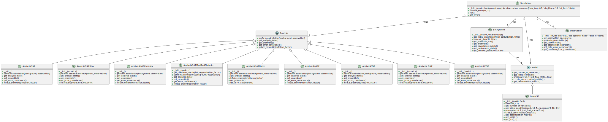

# TEDA - A Computational Toolbox for Teaching Ensemble Based Data Assimilation

### 📚 Citation

If you use **TEDA** in your teaching, research, or publications, please cite the following paper:

> **Nino-Ruiz, E.D., Valbuena, S.R.** (2022).
> *TEDA: A Computational Toolbox for Teaching Ensemble Based Data Assimilation*.
> In: Groen, D., de Mulatier, C., Paszynski, M., Krzhizhanovskaya, V.V., Dongarra, J.J., Sloot, P.M.A. (eds) **Computational Science – ICCS 2022**.
> Lecture Notes in Computer Science, vol 13353. Springer, Cham.
> [https://doi.org/10.1007/978-3-031-08760-8\_60](https://doi.org/10.1007/978-3-031-08760-8_60)

You can also use this BibTeX entry:

```bibtex
@inproceedings{nino2022teda,
  title={TEDA: A Computational Toolbox for Teaching Ensemble Based Data Assimilation},
  author={Nino-Ruiz, Elias D. and Valbuena, Sebastian Racedo},
  booktitle={Computational Science – ICCS 2022},
  series={Lecture Notes in Computer Science},
  volume={13353},
  pages={787--801},
  year={2022},
  publisher={Springer, Cham},
  doi={10.1007/978-3-031-08760-8_60}
}
```

[](https://doi.org/10.1007/978-3-031-08760-8_60)
[](https://pypi.org/project/pyteda/)

### 📦 Installation

You can install **pyteda** directly from PyPI:

```bash
pip install pyteda
```
---

## Introducing TEDA: The Premier Python Toolbox for Teaching Ensemble-based Data Assimilation



We are thrilled to present TEDA, a cutting-edge Python toolbox designed to facilitate the teaching and learning of ensemble-based data assimilation (DA). TEDA caters to the needs of educators and learners alike, offering a comprehensive platform to explore the captivating world of meteorological anomalies, climate change, and DA methodologies.

TEDA stands out as an exceptional resource in the landscape of DA software, as it prioritizes the educational experience. While operational software tends to focus on practical applications, TEDA empowers undergraduate and graduate students by providing an intuitive platform to grasp the intricacies of ensemble-based DA concepts and foster enthusiasm for scientific exploration.

Equipped with a diverse range of features and functionalities, TEDA enriches the learning process by offering powerful visualization tools. Students can delve into error statistics, model errors, observational errors, error distributions, and the dynamic evolution of errors. These visualizations provide multiple perspectives on numerical results, enabling students to develop a deep understanding of ensemble-based DA principles.

TEDA offers numerous ensemble-based DA methods, allowing students to explore an extensive range of techniques. From the stochastic ensemble Kalman filter (EnKF) to dual EnKF formulations, EnKF via Cholesky decomposition, EnKF based on modified Cholesky decomposition, EnKF based on B-localization, and beyond, TEDA equips learners with a comprehensive toolkit to study and compare various DA methodologies.

TEDA's foundation is rooted in the Object-Oriented Programming (OOP) paradigm, enabling effortless integration of new techniques and models. This ensures that TEDA remains at the forefront of the rapidly evolving field of ensemble-based DA, allowing educators and researchers to incorporate the latest advancements into their teaching and experimentation.

Embark on a captivating journey of discovery and knowledge with TEDA as it unveils the secrets of data assimilation. Simulate various DA scenarios, experiment with different model configurations, and witness firsthand the transformative impact of ensemble-based DA methods on forecast accuracy and data analysis.

Unlock your true potential in the realm of data assimilation with TEDA. Whether you are an enthusiastic student or a dedicated educator, TEDA stands as your ultimate companion in unraveling the complexities of ensemble-based DA.

Keywords: Data Assimilation, Ensemble Kalman Filter, Education, Python.

### 🧪 Toy Models for Data Assimilation

To enhance the learning experience, **TEDA** is built around **toy models** that exhibit chaotic behavior under specific configurations. These models are ideal for experimenting with and validating various Data Assimilation (DA) techniques in a hands-on, controlled setting.

Currently, TEDA includes the **Lorenz 96 model** (40 variables), a well-known benchmark in DA research.

> 📌 *Support for other classic chaotic systems like the Duffing equation and Lorenz 63 may be added in future versions.*


## How easy is to use it?

Choose the desired method from the pool of available methods:

```python
from analysis.analysis_enkf_modified_cholesky import AnalysisEnKFModifiedCholesky
```

Select a model to perform the simulations:

```python
model = Lorenz96()
```

Create a background object with the desired parameters:

```python
background = Background(model, ensemble_size=20)
```

Create an analysis object with the desired method and its parameters + the chosen model:

```python
analysis = AnalysisEnKFModifiedCholesky(model, r=2)
```

Define the observation parameters:

```python
observation = Observation(m=32, std_obs=0.01)
```

Set up the parameters for the simulation:

```python
params = {'obs_freq': 0.1, 'obs_times': 10, 'inf_fact': 1.04}

simulation = Simulation(
    model,
    background,
    analysis,
    observation,
    params=params,
    log_level=None  # set to None to disable logging
)
```

and then, run the simulation!

```python
simulation.run()
```


### ✨ Logging (Optional)

> 💡 **Note:** If you want to enable logs (e.g., for debugging or monitoring), just pass a `log_level` when creating the simulation.
> To **disable logs**, use `log_level=None`.

```python
import logging

simulation = Simulation(
    model,
    background,
    analysis,
    observation,
    params=params,
    log_level=logging.INFO  # set to None to disable logging
)
```

You can then request the backgound and analysis errors per assimilation step for plotting purposes or statistical computations:

```python
import matplotlib.pyplot as plt

errb, erra = simulation.get_errors()

plt.figure(figsize=(12, 10))
plt.plot(np.log10(errb),'-ob')
plt.plot(np.log10(erra),'-or')
plt.show()
```

📁 Example usage

See [`examples/basic_template.py`](examples/basic_template.py) for a complete simulation workflow.

---

### 🚀 Installation and Quick Start

We recommend using a virtual environment:

```bash
python -m venv venv
source venv/bin/activate  # On Windows: venv\Scripts\activate
```

Install the required dependencies:

```bash
pip install -r requirements.txt
```

> Or, if you're developing TEDA locally:

```bash
pip install -e .
```

---

### ▶️ Run the basic example

Once installed, you can run the full example with:

```bash
python -m examples.basic_template
```

This will initialize the Lorenz96 model, run an ensemble-based data assimilation simulation, and display the log-relative errors for both the background and analysis states.


## Supported methods


| Class                          | Description                                      | Reference                                                  |
| ------------------------------ | ------------------------------------------------ | ---------------------------------------------------------- |
| AnalysisEnKFShrinkagePrecision | Compute the precision matrix for EnKF Shrinkage Precision. | Nino-Ruiz, Elias D., and Adrian Sandu. "Ensemble Kalman filter implementations based on shrinkage covariance matrix estimation." Ocean Dynamics 65 (2015): 1423-1439.                                                        |
| AnalysisEnKFModifiedCholesky   | Compute the precision matrix for EnKF Modified Cholesky. | Nino-Ruiz, Elias D., Adrian Sandu, and Xinwei Deng. "An ensemble Kalman filter implementation based on modified Cholesky decomposition for inverse covariance matrix estimation." SIAM Journal on Scientific Computing 40.2 (2018): A867-A886.                                                       |
| AnalysisEnKFNaive              | Perform assimilation using Naive EnKF method.    | Nino Ruiz, Elias D., Adrian Sandu, and Jeffrey Anderson. "An efficient implementation of the ensemble Kalman filter based on an iterative Sherman–Morrison formula." Statistics and Computing 25 (2015): 561-577.                                                       |
| AnalysisEnSRF                  | Perform assimilation using EnSRF method.          | Tippett, Michael K., et al. "Ensemble square root filters." Monthly weather review 131.7 (2003): 1485-1490.                                                     |
| AnalysisETKF                   | Perform assimilation using ETKF method.           | Bishop, Craig H., Brian J. Etherton, and Sharanya J. Majumdar. "Adaptive sampling with the ensemble transform Kalman filter. Part I: Theoretical aspects." Monthly weather review 129.3 (2001): 420-436.                                                        |
| AnalysisLETKF                  | Perform assimilation using LETKF method.          | Hunt, Brian R., Eric J. Kostelich, and Istvan Szunyogh. "Efficient data assimilation for spatiotemporal chaos: A local ensemble transform Kalman filter." Physica D: Nonlinear Phenomena 230.1-2 (2007): 112-126.                                                      |
| AnalysisLEnKF                   | Perform assimilation using LEnKF method.          |Ott, Edward, et al. "A local ensemble Kalman filter for atmospheric data assimilation." Tellus A: Dynamic Meteorology and Oceanography 56.5 (2004): 415-428.                                                    |
| AnalysisEnKFBLoc               | Perform assimilation using EnKF B-Loc method.     | Greybush, Steven J., et al. "Balance and ensemble Kalman filter localization techniques." Monthly Weather Review 139.2 (2011): 511-522.                                                      |
| AnalysisEnKFCholesky           | Perform assimilation using EnKF Cholesky decomposition. | Mandel, Jan. Efficient implementation of the ensemble Kalman filter. University of Colorado at Denver and Health Sciences Center, Center for Computational Mathematics, 2006.                                                        |
| AnalysisEnKF                    | Perform assimilation using EnKF full covariance matrix. | Evensen, Geir. Data assimilation: the ensemble Kalman filter. Vol. 2. Berlin: springer, 2009.                                                        |
| Analysis                        | Perform assimilation given background and observations. | Abstract class to define general methods for all assimilation steps.                                                          |

**Analysis (Abstract class for analysis methods)**

| Method                 | Description                                      |
| ---------------------- | ------------------------------------------------ |
| perform_assimilation   | Perform the assimilation step given the background and observations. It takes the following parameters: <br>- **background**: Background object representing the background ensemble or state.<br>- **observation**: Observation object representing the observation used for assimilation. |
| get_analysis_state     | Return the computed column mean of the ensemble Xa. It doesn't take any parameters. |
| get_ensemble           | Return the ensemble Xa. It doesn't take any parameters. |
| get_error_covariance   | Return the computed covariance matrix of the ensemble Xa. It doesn't take any parameters. |
| inflate_ensemble       | Compute the new ensemble Xa given the inflation factor. It takes the following parameter: <br>- **inflation_factor**: Double number indicating the inflation factor to be applied to the ensemble. |

**AnalysisEnKF (Analysis EnKF full covariance matrix)**

| Method                 | Description                                      |
| ---------------------- | ------------------------------------------------ |
| perform_assimilation   | Perform the assimilation step given the background and observations. It takes the following parameters: <br>- **background**: Background object representing the background ensemble or state.<br>- **observation**: Observation object representing the observation used for assimilation. |
| get_analysis_state     | Return the computed column mean of the ensemble Xa. It doesn't take any parameters. |
| get_ensemble           | Return the ensemble Xa. It doesn't take any parameters. |
| get_error_covariance   | Return the computed covariance matrix of the ensemble Xa. It doesn't take any parameters. |
| inflate_ensemble       | Compute the new ensemble Xa given the inflation factor. It takes the following parameter: <br>- **inflation_factor**: Double number indicating the inflation factor to be applied to the ensemble. |

**AnalysisEnKFBLoc (Analysis EnKF B-Loc)**

| Method                 | Description                                      |
| ---------------------- | ------------------------------------------------ |
| perform_assimilation   | Perform the assimilation step given the background and observations. It takes the following parameters: <br>- **background**: Background object representing the background ensemble or state.<br>- **observation**: Observation object representing the observation used for assimilation. |
| get_analysis_state     | Return the computed column mean of the ensemble Xa. It doesn't take any parameters. |
| get_ensemble           | Return the ensemble Xa. It doesn't take any parameters. |
| get_error_covariance   | Return the computed covariance matrix of the ensemble Xa. It doesn't take any parameters. |
| inflate_ensemble       | Compute the new ensemble Xa given the inflation factor. It takes the following parameter: <br>- **inflation_factor**: Double number indicating the inflation factor to be applied to the ensemble. |

**AnalysisEnKFCholesky (EnKF implementation Cholesky)**

| Method                 | Description                                      |
| ---------------------- | ------------------------------------------------ |
| perform_assimilation   | Perform the assimilation step given the background and observations. It takes the following parameters: <br>- **background**: Background object representing the background ensemble or state.<br>- **observation**: Observation object representing the observation used for assimilation. |
| get_analysis_state     | Return the computed column mean of the ensemble Xa. It doesn't take any parameters. |
| get_ensemble           | Return the ensemble Xa. It doesn't take any parameters. |
| get_error_covariance   | Return the computed covariance matrix of the ensemble Xa. It doesn't take any parameters. |
| inflate_ensemble       | Compute the new ensemble Xa given the inflation factor. It takes the following parameter: <br>- **inflation_factor**: Double number indicating the inflation factor to be applied to the ensemble. |

**AnalysisEnKFModifiedCholesky (Analysis EnKF Modified Cholesky decomposition)**

| Method                 | Description                                      |
| ---------------------- | ------------------------------------------------ |
| get_precision_matrix   | Returns the computed precision matrix. It takes the following parameters: <br>- **DX**: Deviation matrix.<br>- **regularization_factor**: Value used as alpha in the ridge model. |
| perform_assimilation   | Perform the assimilation step given the background and observations. It takes the following parameters: <br>- **background**: Background object representing the background ensemble or state.<br>- **observation**: Observation object representing the observation used for assimilation. |
| get_analysis_state     | Return the computed column mean of the ensemble Xa. It doesn't take any parameters. |
| get_ensemble           | Return the ensemble Xa. It doesn't take any parameters. |
| get_error_covariance   | Return the computed covariance matrix of the ensemble Xa. It doesn't take any parameters. |
| inflate_ensemble       | Compute the new ensemble Xa given the inflation factor. It takes the following parameter: <br>- **inflation_factor**: Double number indicating the inflation factor to be applied to the ensemble. |

**AnalysisEnKFNaive (Analysis EnKF Naive)**

| Method                 | Description                                      |
| ---------------------- | ------------------------------------------------ |
| perform_assimilation   | Perform the assimilation step given the background and observations. It takes the following parameters: <br>- **background**: Background object representing the background ensemble or state.<br>- **observation**: Observation object representing the observation used for assimilation. |
| get_analysis_state     | Return the computed column mean of the ensemble Xa. It doesn't take any parameters. |
| inflate_ensemble       | Compute the new ensemble Xa given the inflation factor. It takes the following parameter: <br>- **inflation_factor**: Double number indicating the inflation factor to be applied to the ensemble. |
| get_ensemble           | Return the ensemble Xa. It doesn't take any parameters. |
| get_error_covariance   | Return the computed covariance matrix of the ensemble Xa. It doesn't take any parameters. |

**AnalysisEnKFShrinkagePrecision (Analysis EnKF Shrinkage Precision)**

| Method                 | Description                                      |
| ---------------------- | ------------------------------------------------ |
| get_precision_matrix   | Returns the computed precision matrix. It takes the following parameters: <br>- **DX**: Deviation matrix.<br>- **regularization_factor**: Value used as alpha in the ridge model. |
| perform_assimilation   | Perform the assimilation step given the background and observations. It takes the following parameters: <br>- **background**: Background object representing the background ensemble or state.<br>- **observation**: Observation object representing the observation used for assimilation. |
| get_analysis_state     | Return the computed column mean of the ensemble Xa. It doesn't take any parameters. |
| get_ensemble           | Return the ensemble Xa. It doesn't take any parameters. |
| get_error_covariance   | Return the computed covariance matrix of the ensemble Xa. It doesn't take any parameters. |
| inflate_ensemble       | Compute the new ensemble Xa given the inflation factor. It takes the following parameter: <br>- **inflation_factor**: Double number indicating the inflation factor to be applied to the ensemble. |

**AnalysisEnSRF (Analysis EnSRF)**

| Method                 | Description                                      |
| ---------------------- | ------------------------------------------------ |
| perform_assimilation   | Perform the assimilation step given the background and observations. It takes the following parameters: <br>- **background**: Background object representing the background ensemble or state.<br>- **observation**: Observation object representing the observation used for assimilation. |
| get_analysis_state     | Return the computed column mean of the ensemble Xa. It doesn't take any parameters. |
| get_ensemble           | Return the ensemble Xa. It doesn't take any parameters. |
| get_error_covariance   | Return the computed covariance matrix of the ensemble Xa. It doesn't take any parameters. |
| inflate_ensemble       | Compute the new ensemble Xa given the inflation factor. It takes the following parameter: <br>- **inflation_factor**: Double number indicating the inflation factor to be applied to the ensemble. |

**AnalysisETKF (Analysis Ensemble Transform Kalman Filter (ETKF))**

| Method                 | Description                                      |
| ---------------------- | ------------------------------------------------ |
| perform_assimilation   | Perform the assimilation step given the background and observations. It takes the following parameters: <br>- **background**: Background object representing the background ensemble or state.<br>- **observation**: Observation object representing the observation used for assimilation. |
| get_analysis_state     | Return the computed column mean of the ensemble Xa. It doesn't take any parameters. |
| get_ensemble           | Return the ensemble Xa. It doesn't take any parameters. |
| get_error_covariance   | Return the computed covariance matrix of the ensemble Xa. It doesn't take any parameters. |
| inflate_ensemble       | Compute the new ensemble Xa given the inflation factor. It takes the following parameter: <br>- **inflation_factor**: Double number indicating the inflation factor to be applied to the ensemble. |

**AnalysisLEnKF (Analysis LEnKF)**

| Method                 | Description                                      |
| ---------------------- | ------------------------------------------------ |
| perform_assimilation   | Perform the assimilation step given the background and observations. It takes the following parameters: <br>- **background**: Background object representing the background ensemble or state.<br>- **observation**: Observation object representing the observation used for assimilation. |
| get_analysis_state     | Return the computed column mean of the ensemble Xa. It doesn't take any parameters. |
| inflate_ensemble       | Compute the new ensemble Xa given the inflation factor. It takes the following parameter: <br>- **inflation_factor**: Double number indicating the inflation factor to be applied to the ensemble. |
| get_ensemble           | Return the ensemble Xa. It doesn't take any parameters. |
| get_error_covariance   | Return the computed covariance matrix of the ensemble Xa. It doesn't take any parameters. |

**AnalysisLETKF (Analysis Local Ensemble Transform Kalman Filter (LETKF))**

| Method                 | Description                                      |
| ---------------------- | ------------------------------------------------ |
| perform_assimilation   | Perform the assimilation step given the background and observations. It takes the following parameters: <br>- **background**: Background object representing the background ensemble or state.<br>- **observation**: Observation object representing the observation used for assimilation. |
| get_analysis_state     | Return the computed column mean of the ensemble Xa. It doesn't take any parameters. |
| inflate_ensemble       | Compute the new ensemble Xa given the inflation factor. It takes the following parameter: <br>- **inflation_factor**: Double number indicating the inflation factor to be applied to the ensemble. |
| get_ensemble           | Return the ensemble Xa. It doesn't take any parameters. |
| get_error_covariance   | Return the computed covariance matrix of the ensemble Xa. It doesn't take any parameters. |

